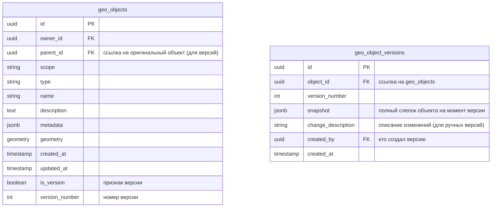
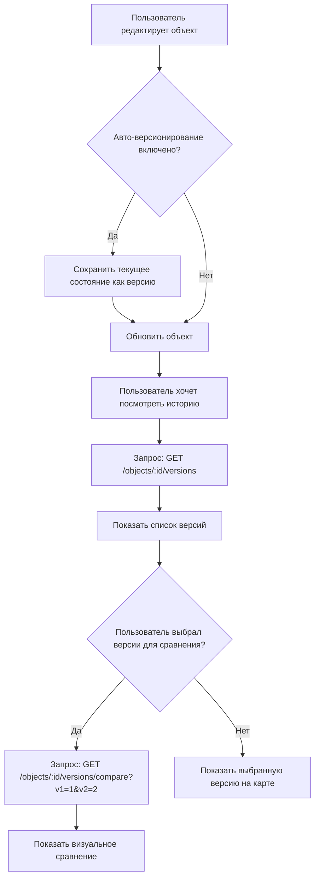

# План: История версий гео-объектов

## Архитектура решения

### База данных



### API Endpoints

| Method | Endpoint | Описание |
|--------|----------|----------|
| GET | `/api/objects/:id/versions` | Получить список всех версий объекта |
| GET | `/api/objects/:id/versions/:versionId` | Получить конкретную версию |
| POST | `/api/objects/:id/versions` | Создать ручную версию |
| GET | `/api/objects/:id/versions/compare?v1=X&v2=Y` | Сравнить две версии |

---

## Детальный план реализации

### 1. База данных

- [ ] **Новая таблица `geo_object_versions`** - хранит полные слепки версий
- [ ] **Колонка `parent_id` в `geo_objects`** - связывает версии с оригинальным объектом
- [ ] **Колонка `is_version`** - разделяет "живые" объекты и версии
- [ ] **Колонка `version_number`** - номер версии

### 2. Backend (Go)

#### Модель
- [ ] Добавить `GeoObjectVersion` модель
- [ ] Обновить `GeoObject` модель (parent_id, is_version, version_number)

#### Repository
- [ ] Добавить методы в `GeoObjectRepository`:
  - `CreateVersion(ctx, objectID, snapshot)` - создание версии
  - `GetVersions(ctx, objectID)` - получить все версии
  - `GetVersionByID(ctx, versionID)` - получить версию
  - `GetVersionsForCompare(ctx, objectID, v1, v2)` - получить две версии для сравнения
  - `GetLiveObject(ctx, objectID)` - получить "живой" объект (не версию)

#### Service
- [ ] Добавить `GeoObjectVersionService`:
  - `CreateManualVersion(ctx, objectID, description)` - ручное создание
  - `GetVersions(ctx, objectID)` - список версий
  - `GetVersion(ctx, versionID)` - конкретная версия
  - `CompareVersions(ctx, objectID, v1, v2)` - сравнение
- [ ] Обновить `GeoObjectService.Update()`:
  - При каждом update автоматически создавать версию snapshot
  - Опционально: параметр `skip_version` для пропуска создания версии

#### Handler
- [ ] Добавить новые эндпоинты в `GeoObjectHandler`:
  - `GET /objects/:id/versions` - список версий
  - `GET /objects/:id/versions/:versionId` - детали версии
  - `POST /objects/:id/versions` - создать версию вручную
  - `GET /objects/:id/versions/compare` - сравнить версии

### 3. Frontend (TypeScript/React)

#### Types
- [ ] Добавить типы:
  - `GeoObjectVersion`
  - `VersionListResponse`
  - `VersionCompareResult`

#### API Service
- [ ] Обновить `api.ts`:
  - `getVersions(objectId)` - получить список версий
  - `getVersion(objectId, versionId)` - получить версию
  - `createVersion(objectId, description)` - создать версию
  - `compareVersions(objectId, v1, v2)` - сравнить версии

#### GeoObjectService
- [ ] Добавить методы:
  - `getVersions(objectId)`
  - `createVersion(objectId, description?)`
  - `compareVersions(objectId, v1, v2)`

#### UI Компоненты
- [ ] **VersionHistoryPanel** - компонент списка версий:
  - Показывает timeline версий
  - Дата создания, номер версии, автор
  - Кнопка выбора версии для просмотра
  - Кнопка ручного создания версии

- [ ] **VersionCompareView** - компонент визуального сравнения:
  - Side-by-side отображение двух версий
  - Подсветка изменений geometry (разные цвета для старой/новой)
  - Таблица изменений атрибутов (имя, описание, тип, metadata)

- [ ] **ObjectDetailPanel** - обновить:
  - Добавить вкладку "История"
  - Показать текущую версию и ссылку на историю

---

## Примеры JSON

### Ответ списка версий
```json
{
  "versions": [
    {
      "id": "uuid-v4",
      "version_number": 3,
      "created_at": "2024-01-15T10:30:00Z",
      "created_by": "user-uuid",
      "change_description": "Updated river path",
      "changes": {
        "geometry": true,
        "name": false,
        "description": true
      }
    },
    {
      "id": "uuid-v4", 
      "version_number": 2,
      "created_at": "2024-01-10T08:00:00Z",
      "created_by": "user-uuid",
      "change_description": null,
      "changes": {
        "geometry": true,
        "name": true,
        "description": false
      }
    }
  ],
  "total": 3,
  "current_version": 3
}
```

### Ответ сравнения версий
```json
{
  "version1": {
    "id": "uuid-v4",
    "version_number": 1,
    "geometry": {...},
    "name": "Almaty River",
    "description": "Old description"
  },
  "version2": {
    "id": "uuid-v4", 
    "version_number": 2,
    "geometry": {...},
    "name": "Almaty River - Updated",
    "description": "New description"
  },
  "diff": {
    "geometry_changed": true,
    "name_changed": true,
    "description_changed": true,
    "geometry_diff": {
      "type": "LineString",
      "old_coords_count": 100,
      "new_coords_count": 150
    }
  }
}
```

---

## Поток работы


